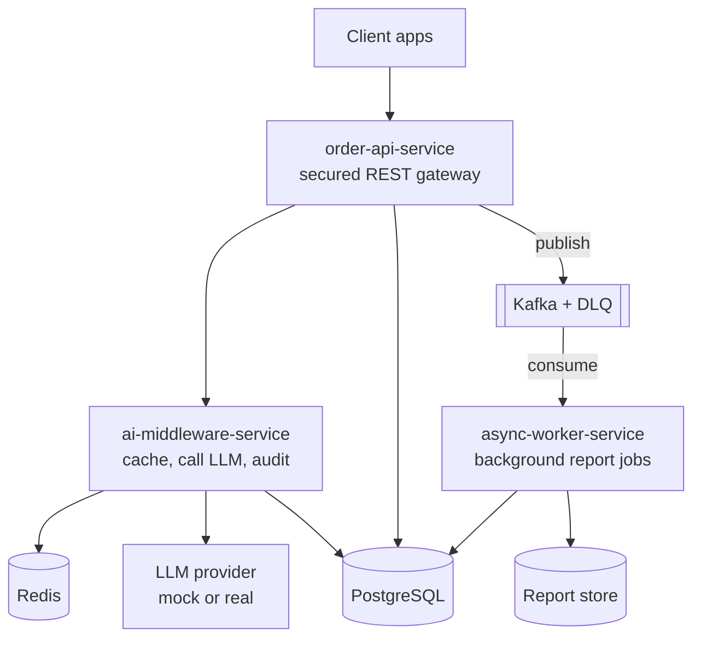
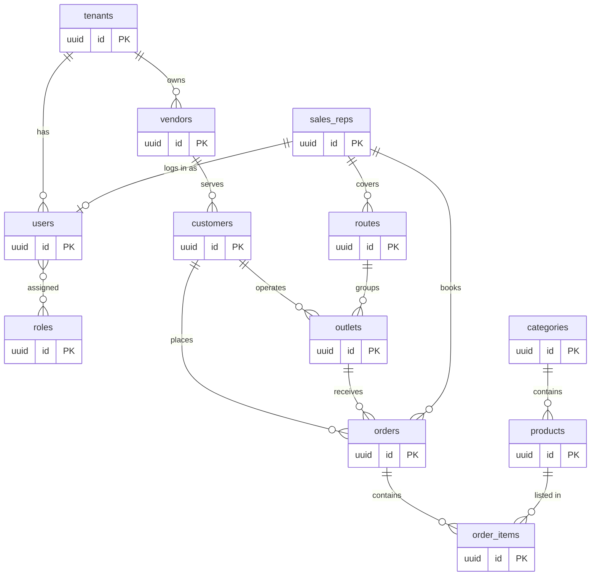
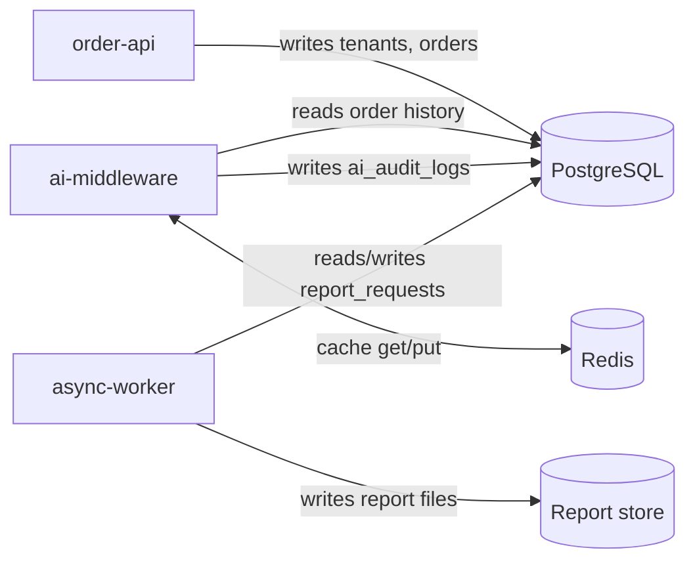
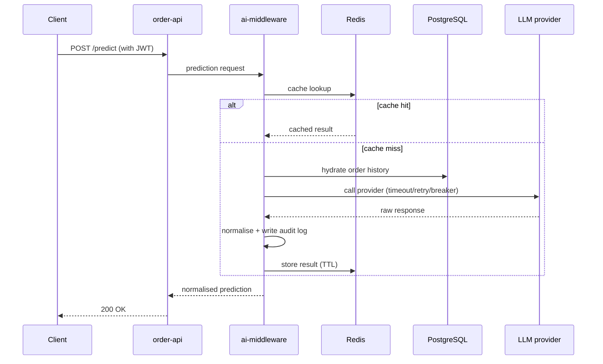
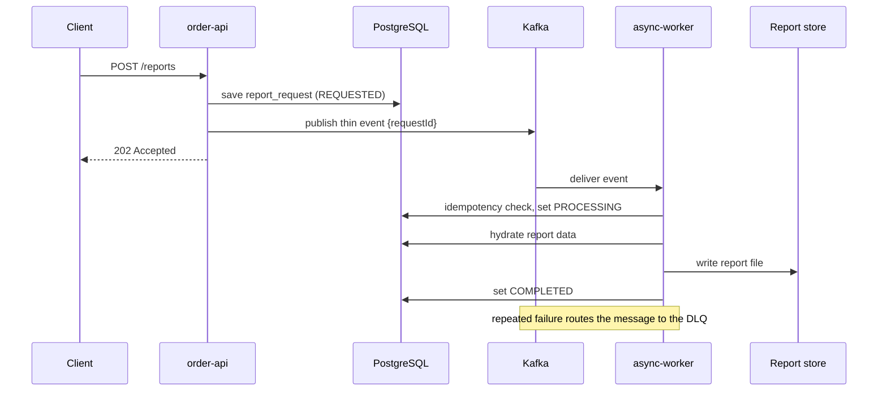
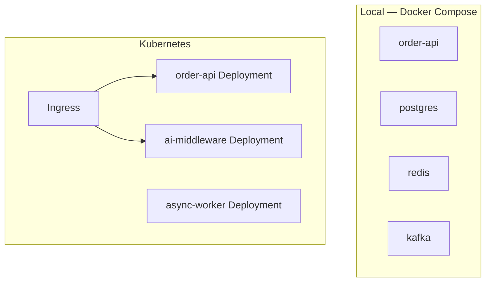

# OrderIQ — Architecture

> Status: **baseline complete**. Diagrams are embedded as Mermaid (rendered by GitHub) so they stay in version control and diff cleanly.

This document explains what OrderIQ is, how its parts fit together, and how data and requests move through it.

---

## 1. System overview

OrderIQ is three cooperating Spring Boot services around an FMCG order database. The `order-api-service` is the secured front door; the `ai-middleware-service` handles AI predictions; the `async-worker-service` does slow background work driven by events. PostgreSQL is the shared system of record; Redis caches AI results; Kafka carries asynchronous events.

## 2. Component responsibilities

| Service | Responsibilities |
| --- | --- |
| **order-api-service** | Authentication (JWT/OAuth2), tenant-aware CRUD for the business domain, request validation, exception handling, publishing async events. |
| **ai-middleware-service** | LLM provider abstraction, context hydration from the DB, Redis caching, resilient provider calls (timeout/retry/circuit breaker/fallback), response normalisation, AI audit logging. |
| **async-worker-service** | Consumes events, generates reports, manages a status lifecycle, enforces idempotency, and routes poison messages to a dead-letter queue. |

## 3. Data model

The schema groups into four concerns: tenancy & identity, the sales network, the catalog, and transactions. Every business table carries a `tenant_id` (the isolation key). Three operational tables (`report_requests`, `ai_audit_logs`, `idempotency_records`) are intentionally loosely coupled and are added in later phases.

**Multi-tenancy:** the current baseline uses a shared schema with a `tenant_id` discriminator column. Schema-per-vendor is a documented alternative (see `DECISIONS.md`).

## 4. Data-flow view

Which service reads and writes which store:

## 5. Synchronous prediction flow

A prediction is answered while the caller waits. The cache is checked first; on a miss we hydrate context, call the provider behind a resilience layer, normalise, audit, and cache.

## 6. Asynchronous report flow

Slow work is not done inline. The API records the request, publishes a thin event (IDs only), and returns immediately. The worker does the heavy lifting and advances the status.

## 7. Cross-cutting concerns

- **Caching** — Redis stores AI results under tenant-aware keys with a TTL; a cache miss falls through to the provider; if Redis is down the system degrades rather than fails.
- **Resilience** — Resilience4j wraps provider calls with timeout, retry, circuit breaker, and fallback. (See `FAILURE_HANDLING.md`.)
- **Observability** — correlation IDs thread through logs; OpenTelemetry traces span services; Prometheus scrapes metrics; Grafana visualises them. (See `OBSERVABILITY.md`.)
- **Security** — JWT/OAuth2 resource server; role-based access on endpoints; tenant-scoped authorization on every query. (See `SECURITY.md`.)

## 8. Deployment view

Locally everything runs as containers via Docker Compose. For orchestration, each service is deployed as a Kubernetes Deployment fronted by Services and an Ingress.

Infrastructure-as-code (Terraform / AWS SAM) for cloud resources lives in `infra/`. (See `DEPLOYMENT.md`.)

## 9. Technology choices

Java 21, Spring Boot 3.5.x, Maven, PostgreSQL + Spring Data JPA, Flyway, Redis, Kafka, Resilience4j, OpenTelemetry/Prometheus/Grafana, Docker, Kubernetes, Terraform/SAM, GitHub Actions. The reasoning and alternatives for each significant choice are recorded in `DECISIONS.md`.
